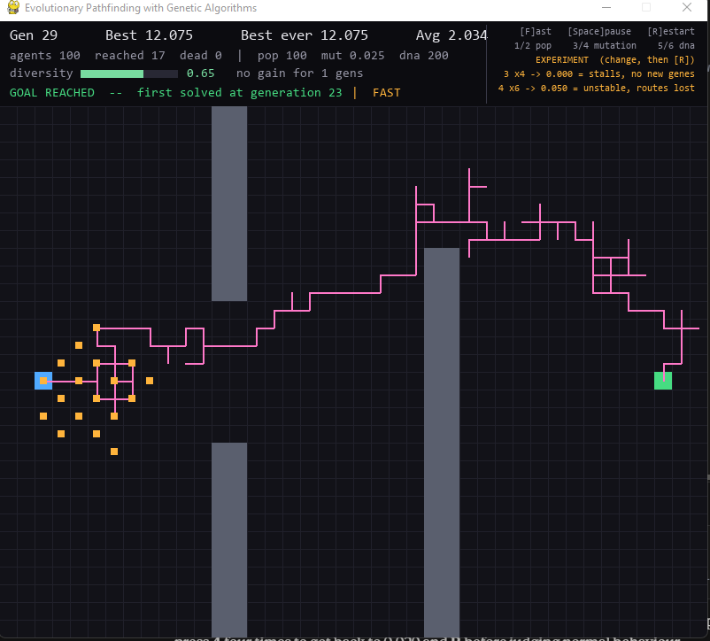
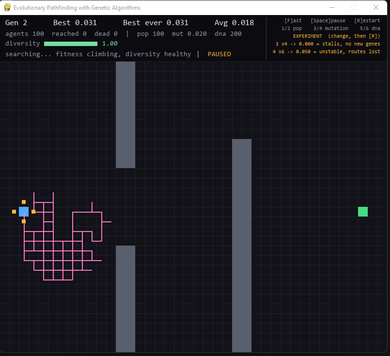
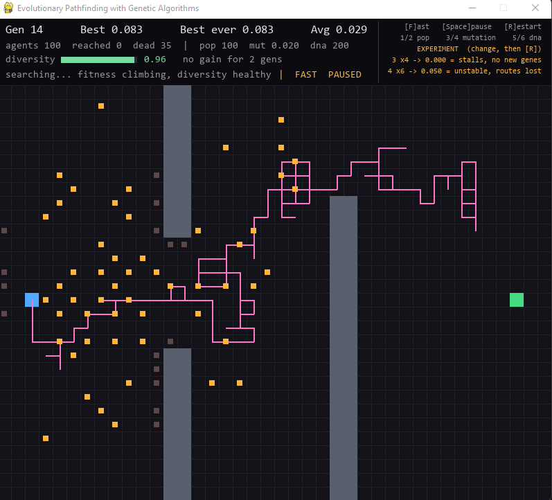
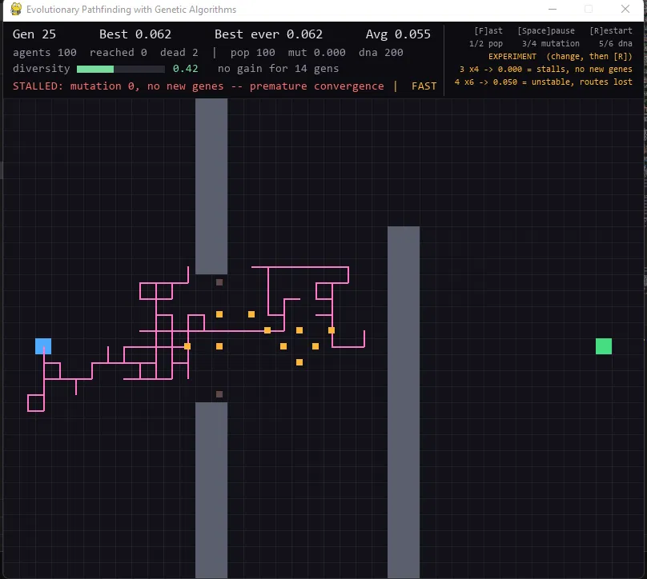
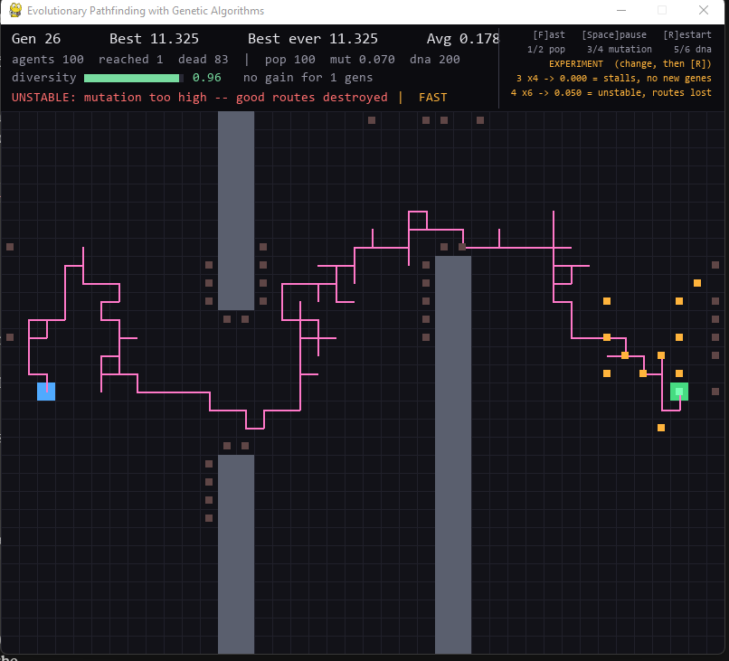

# EvoPath — Evolutionary Agent Navigation

A population of agents learns to navigate an obstacle course using a genetic
algorithm. No neural network, no training data, no machine-learning library —
just selection, crossover and mutation applied to sequences of movement
instructions.

Built with Python and Pygame.



---

## What this is (and what it is not)

**This is not a trained model.** There is no dataset, no gradient descent, no
neural network and no learned weights. Nothing in this project is "trained".

**This is a search algorithm.** Each agent is a fixed sequence of 200 movement
instructions. The space of possible sequences is 4^200 — far too large to
enumerate. The genetic algorithm searches that space by scoring candidate
sequences, preferentially copying the better ones, recombining them, and
introducing random variation.

An individual agent never learns anything. It is created, it executes its
instructions blindly, and it is scored. What improves across generations is the
*population's collection of instruction sequences* — bad sequences stop being
copied, good fragments accumulate.

---

## The problem

A start point on the left, a goal on the right, and three walls arranged so that
no straight path exists. A successful agent must:

1. travel right and thread a gap in the middle of the first wall pair,
2. climb up and over the third wall,
3. descend and arrive at the goal.

The shortest legal route is roughly 51 grid moves. Agents that walk off the grid
or into a wall are killed immediately and scored from where they stopped.

---

## How the genetic algorithm works

```
        random population
                |
                v
      +--> evaluate fitness          score every agent
      |         |
      |         v
      |     selection               keep the best, weight the rest
      |         |
      |         v
      |     crossover               splice two parents
      |         |
      |         v
      |      mutation               flip a few genes at random
      |         |
      |         v
      +---- new population
```

### Agent representation

Each agent's genome is a flat list of integers, each indexing one of four
directions:

```
DNA = [3, 0, 3, 3, 1, 2, ...]     # 0=up 1=down 2=left 3=right
```

Integers rather than direction names, because mutation then reduces to
`random.randrange(4)` — one always-valid operation — and crossover is a plain
list slice. The genome is encoded in the simplest form the genetic operators can
work on.

The agent has no perception and no logic. It does not know where the goal is or
that walls exist. It executes one instruction per simulation step.

### Fitness

Fitness is the only signal in the system. The algorithm has no idea it is
navigating a maze; it sees one number per agent and copies the DNA of agents
with high numbers.

```
fitness = 1 / (1 + manhattan_distance_to_goal)
if reached_goal:  fitness += 10 + (unused_steps / genome_length) * 5
if died:          fitness *= 0.7
```

Three deliberate choices:

- **Distance-based, not success-based.** In generation 1, zero agents reach the
  goal. A pure success/failure score would give every agent an identical 0 and
  evolution would never start — a sparse reward. Distance gives *partial
  credit*, so a near-miss outranks an immediate crash and selection has a
  gradient to climb.
- **`1/(1+d)` rather than `-d`.** Keeps fitness strictly positive, which
  fitness-proportional selection requires (a negative weight is meaningless).
  It is also non-linear: closing the last few cells is worth far more than the
  first few.
- **Manhattan distance, not Euclidean.** Agents move on a grid in four
  directions, so Manhattan distance is the true number of moves remaining.
- **Death multiplies rather than zeroes.** An agent that got 30 cells before
  crashing still holds 30 useful genes. Zeroing its fitness would discard that.
- **A speed bonus after arrival.** Once several agents reach the goal, distance
  can no longer separate them. Rewarding leftover steps keeps a gradient alive
  after success, so the population goes on to refine a *shorter* path.

### Selection

Elitism plus fitness-proportional (roulette-wheel) selection.

The top 4 agents are copied into the next generation completely unmodified. This
guarantees the best solution found so far can never be destroyed by an unlucky
crossover, so best-ever fitness is monotonically non-decreasing.

The remaining 96 slots are filled by parents drawn at random, weighted by
fitness. Measured over 10,000 draws, the top-ranked agent was selected 241 times
and the bottom-ranked 61 — roughly matching their fitness ratio.

Weighted-random rather than "breed only from the top 10", because truncation
selection collapses diversity: all DNA descends from ten ancestors and the
search stalls in a local optimum. Roulette keeps weak agents in the pool with
low but nonzero probability, preserving gene fragments that are useless alone but
valuable in combination — for example, "up" sequences that are pointless early
but essential later for climbing the third wall.

### Crossover

Single-point: a random cut position, the child taking one parent's opening moves
and the other's closing moves.

```
Parent A:  up up right right | down down right right
Parent B:  right right up up | right down down up
Child:     up up right right | right down down up
```

This works because a movement sequence is naturally divided by *time*: early
genes get you through the middle gap, later genes get you over the third wall.
So a parent with a good opening can be combined with a parent that has a good
ending, and the child may do both even though neither parent succeeded.
Crossover recombines partial solutions into whole ones.

The cut is random each time rather than fixed, so any prefix can pair with any
suffix.

### Mutation

Each gene is independently replaced with a random direction at probability
`MUTATION_RATE` (default 0.025 — about 5 mutations per 200-gene child).

Mutation is the only source of genuinely new genetic material. Crossover can
only reshuffle genes that already exist in the population, and selection
continually *removes* variety as weak agents stop being copied. Without
mutation, diversity drains monotonically until every agent is a near-clone,
crossover between identical parents produces identical children, and the search
dies.

Elite agents are never mutated — otherwise the best-known solution could be
damaged and fitness could fall between generations.

---

## Results

All figures below are from actual runs; generation counts vary between runs
because the process is stochastic.

### A typical successful run

| Generation | Best fitness | State |
|---|---|---|
| 2 | 0.031 | population dies near the start, no coherent path |
| 14 | 0.083 | agents push through the middle gap |
| 23 | > 11 | first agent reaches the goal |
| 29 | 12.075 | 17 of 100 agents arriving; average fitness 2.034 |

Average fitness rising from 0.018 to over 2.0 is the important number: the
*whole population* improved, not just one lucky individual.

| Generation 2 | Generation 14 | Solved |
|---|---|---|
|  |  |  |

### Experiment 1 — genome length was the binding constraint

An early version used 120 instructions and **never** solved the map, plateauing
at fitness 0.062 with the best agent stranded 14 cells short. The obvious
hypothesis was premature convergence, so mutation was tripled from 0.01 to 0.03.

Diversity duly rose from 0.75 to 0.96 — and the outcome did not change at all.
Both configurations plateaued at exactly 0.062 and 14 cells.

The bottleneck was the step limit, not diversity: the shortest route is ~51
moves and an evolved route wanders, so 120 instructions could not physically
reach the goal. Raising the genome to 200 solved the map at generation 39 on the
first attempt.

The lesson recorded here deliberately: the parameter was set from a measurement
that *contradicted* the initial guess.

### Experiment 2 — mutation rate, measured at four settings

| Mutation | Diversity | Best fitness | Solved | Failure mode |
|---|---|---|---|---|
| 0.000 | 0.42, falling | 0.062 | never | gene pool collapse |
| 0.025 | 0.65 | 12.075 | gen 23 | — works |
| 0.070 | 0.96 | 11.325 | gen 26, only 1 agent | unstable |
| 0.120 | 1.00 | 0.083 | never | variation swamps selection |

Both extremes fail, for opposite reasons.

At **0.000**, no new genes can appear. Selection grinds the pool down to
variations on one mediocre route; diversity falls to 0.42 and best fitness
freezes for 14+ generations. This is premature convergence.



At **0.120**, diversity is a maximal 1.00 and the run *still* fails — best
fitness stuck at 0.083 with no improvement for 18 generations. Mutation is
destroying good inherited sequences faster than selection can accumulate them,
so the search degenerates into random search. High diversity is not the
objective; it is only a means.



This is the exploration/exploitation trade-off, measured rather than asserted.

### Other observations

- **Diversity falling is not always bad.** In healthy runs it drops from 0.96 to
  ~0.65 once agents begin reaching the goal. That is the population correctly
  concentrating on a route that works. Falling diversity is only a problem when
  fitness is simultaneously flat.
- **Fitness keeps rising after the first success** (11.175 → 12.325 over 50
  generations) with distance already at zero. That increase is entirely the
  speed bonus: evolution shortening the path.

---

## Architecture

| File | Responsibility |
|---|---|
| `config.py` | every tunable parameter and colour in one place |
| `agent.py` | one individual: genome, movement, collision, fitness |
| `population.py` | the genetic algorithm: evaluate, select, crossover, mutate, breed |
| `main.py` | Pygame loop, rendering, HUD, live parameter controls |

The split follows the conceptual boundaries: `agent.py` is about an individual,
`population.py` is about the group. The genetic algorithm has no dependency on
Pygame, which is why the diagnostic scripts can run it headlessly.

Collision uses a precomputed `set` of wall cells, making each check O(1) — with
100 agents × 200 steps that is 20,000 lookups per generation.

### Tests

Each genetic operator was verified in isolation before being wired into the
loop:

| Script | Verifies |
|---|---|
| `test_selection.py` | selection frequency tracks fitness; weak agents retain nonzero probability |
| `test_crossover.py` | 200 children are all valid single-point splices; genome length preserved |
| `test_mutation.py` | observed mutation count matches theory; all genes stay in valid range |
| `test_evolution.py` | headless multi-generation runs comparing parameter settings |

---

## How to run

Requires Python 3.9+ and Pygame.

```bash
pip install pygame
python main.py
```

### Controls

| Key | Action |
|---|---|
| `F` | fast mode (6× simulation speed) |
| `Space` | pause |
| `R` | restart, applying any changed parameters |
| `1` / `2` | population size down / up |
| `3` / `4` | mutation rate down / up |
| `5` / `6` | genome length down / up |
| `Esc` | quit |

Parameter changes take effect on the next `R` restart, since altering genome
length mid-run would produce agents whose genomes cannot be crossed over.

### Reproducing the experiments

- **Premature convergence:** press `3` five times (mutation → 0.000), then `R`.
  Watch the diversity bar drain and the diagnosis turn red.
- **Instability:** press `4` until mutation reads ~0.070, then `R`. The goal is
  found but very few agents hold onto the route.

### Reading the HUD

- **Best / Best ever / Avg** — fitness for the last completed generation.
  Average is the better measure of whether the population as a whole improved.
- **diversity** — fraction of genome positions where agents still disagree. 1.00
  = fully varied, near 0 = clones. Turns red below 0.35.
- **diagnosis line** — plain-language verdict: searching, stalled, unstable, or
  solved.
- **pink path** — the route taken by the previous generation's best agent.

---

## Limitations

- **The genome is an open-loop instruction list, not a policy.** Agents do not
  react to their surroundings; they replay a fixed sequence. Move the goal and
  every evolved solution is worthless — nothing transfers.
- **No generalisation.** The result is one route for one map, not a navigation
  strategy.
- **Fitness is hand-designed.** The reward shaping (distance, goal bonus, speed
  bonus, death penalty) encodes human assumptions about what "good" means.
- **Local optima.** Elitism plus roulette mitigates premature convergence but
  does not eliminate it; some seeds stall.
- **Cost scales with population × genome length**, and every candidate must be
  simulated in full to be scored.

---

## Possible extensions

- **Evolve a policy instead of a route.** Replace the instruction list with a
  small neural network mapping local observations (nearby walls, direction to
  goal) to an action, and evolve its weights — a neuroevolution approach such as
  NEAT. The result would generalise across maps.
- **Reinforcement learning** (Q-learning, policy gradients) would use the
  per-step reward signal a genetic algorithm throws away, likely reaching a
  solution in far fewer simulated steps.
- **Adaptive mutation rate** — high early for exploration, decaying as fitness
  plateaus, which the two experiments above suggest directly.
- **Tournament selection** for tunable selection pressure.
- **Fitness plotted over generations**, and averaging across random seeds
  instead of reporting single runs.
- **Randomised obstacle layouts** to force generality rather than memorisation.